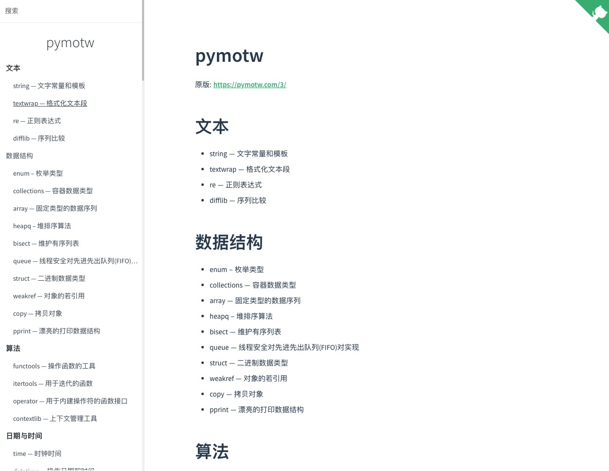

# pymotw

每周Python3模块 中文版

## 文本
- string — 文字常量和模板
- textwrap — 格式化文本段
- re — 正则表达式
- difflib — 序列比较

## 数据结构
- enum – 枚举类型
- collections — 容器数据类型
- array — 固定类型的数据序列
- heapq – 堆排序算法
- bisect — 维护有序列表
- queue — 线程安全对先进先出队列(FIFO)对实现
- struct — 二进制数据类型
- weakref — 对象的若引用
- copy — 拷贝对象
- pprint — 漂亮的打印数据结构

## 算法
- functools — 操作函数的工具
- itertools — 用于迭代的函数
- operator — 用于内建操作符的函数接口
- contextlib — 上下文管理工具

## 日期与时间
- time — 时钟时间
- datetime — 操作日期和时间
- calendar — 操作日期

## 数学
- decimal — 定点小数
- fractions — 分数
- random — 伪随机数生成器
- math — 数学函数
- statistics — 统计计算

## 文件系统
- os.path — 平台独立的文件名操作工具
- pathlib — 像操作对象一样操作文件系统路径
- glob — 文件名的模式匹配
- fnmatch —  类 Unix 的模式匹配
- linecache — 快速的读取文本文件
- tempfile — 临时文件系统文件和对象
- shutil — 高级的文件操作
- filecmp — 文件比较
- mmap — 内存文件映射
- codecs — 字符串编码与解码
- io — 文本、二级制和原始 I/O 流的操作工具

## 数据持久化和转换

- pickle — 对象序列化
- shelve — 对象的持久化存储
- dbm — Unix 下的键值数据库(key-value)
- sqlite3 — 内建关系型数据库
- xml.etree.ElementTree — 操作 XML 的API
- csv — 操作 csv 文件的 API

## 数据压缩和归档
- zlib — GNU zlib 压缩库
- gzip — 读写 GNU zip 压缩文件
- bz2 — bzip2 压缩库
- tarfile — Tar 打包接口
- zipfile — ZIP 打包接口

## 密码学
- hashlib — 哈希库
- hmac — 密码信息的签名和验证

## 基于进程、线程和协程的并发库
- subprocess — 子进程操作库
- signal — 异步系统事件
- threading — 线程操作库
- multiprocessing — 像管理线程一样管理进程
- asyncio — 针对异步 I/O,事件循环(event loop), 和并发的工具
- concurrent.futures — 并发任务的管理工具

## 网络
- ipaddress — 互联网地址
- socket — 网络通信
- selectors —  I/O 多路选择的抽象
- select — 更高效的等待 I/O
- socketserver — 创建网络服务器

## 互联网
- urllib.parse — 解析 URL
- urllib.request — 网络资源访问
- urllib.robotparser — 互联网爬虫控制
- base64 — 利用 ASCII 编码二进制数据
- http.server — 实现 Web Servers 的基础工具
- http.cookies — HTTP Cookies 操作工具
- webbrowser — 展示 web 页面
- uuid — uuid 操作工具
- json —  json 操作工具
- xmlrpc.client — XML-RPC 的客户端库
- xmlrpc.server — XML-RPC 的服务端库

## 邮件
- smtplib — 简单邮件传输协议的客户端库
- smtpd — 简单邮件传输协议的服务端库
- mailbox — 管理邮件归档
- imaplib — IMAP4 协议的客户端库

## 应用构建模块
- argparse — 命令行选项和参数解析
- getopt — 命令行选项解析
- readline — GNU readline 库
- getpass — 安全密码提示符
- cmd — 基于行的命令行解析
- shlex — Parse Shell-style Syntaxes
- configparser — 操作配置文件工具
- logging — 用 logging 库来报告状态、错误和各类信息
- fileinput — 命令行过滤框架
- atexit — 程序退出回调
- sched — 定时消息调度器

## 国际化和本地化
- gettext — 信息目录
- locale — 本地化API

## 开发工具
- pydoc — 模块的在线帮助
- doctest — 通过文档来测试
- unittest — 自动测试框架
- trace — 跟随程序流
- traceback — 异常和栈的回溯
- cgitb — 详细的回溯报告
- pdb — 交互式的调试器
- profile and pstats — 性能分析
- timeit — 为 python 程序计时
- tabnanny — 缩进验证
- compileall — 字节编译源文件
- pyclbr —  浏览类信息的工具
- venv — 创建虚拟环境
- ensurepip — 安装 python 包安装器

## 运行时特性
- site — 不同平台的配置管理
- sys — 系统配置
- os — 特定操作系统的具体配置
- platform — 系统版本信息
- resource — 系统资源管理
- gc — 垃圾回收
- sysconfig —  解释器编译时间配置

## 语言工具
- warnings — 非致命错误的警告工具
- abc — 抽象基类
- dis — Python字节码的反汇编器
- inspect — 检查运行中的对象

## 模块和包
- importlib — Python的import机制
- pkgutil — 包管理工具
- zipimport — 从ZIP归档中国年加载Python代码

## Unix-specific服务
- pwd — Unix 秘密数据库
- grp — Unix 分组数据库

## Py2到Py3的迁移备注
- 引用
- 新模块
- 重命名到模块
- 移除到模块
- 弃用的模块
- 模块变化的总结

## 标准库之外
- 文本
- 算法
- 日期与时间
- 数学
- 数据持久与转换
- 密码学
- 基于进程、线程和协程的并发库
- 网络
- 邮件
- 应用构建模块
- 开发工具

##  关于每周Python3模块

- 订阅
- 工具
- 翻译其他版本
- 版权和许可
